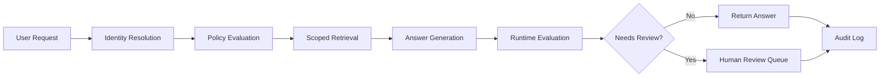

# Architecture Notes

## Purpose

This repository demonstrates an **AI agent control plane** rather than only an answer-generation pipeline.

## Key architectural principle

RAG belongs to the **capability layer**. The following belong to the **control layer**:

- identity
- authorization
- policy evaluation
- runtime evaluation
- auditability
- review routing
- traceability

## Request lifecycle

## Why this architecture is useful

A request should not move directly from prompt to response in systems where:

- authorization matters
- tool usage has consequences
- auditability is required
- confidence may be weak
- human review may be appropriate
